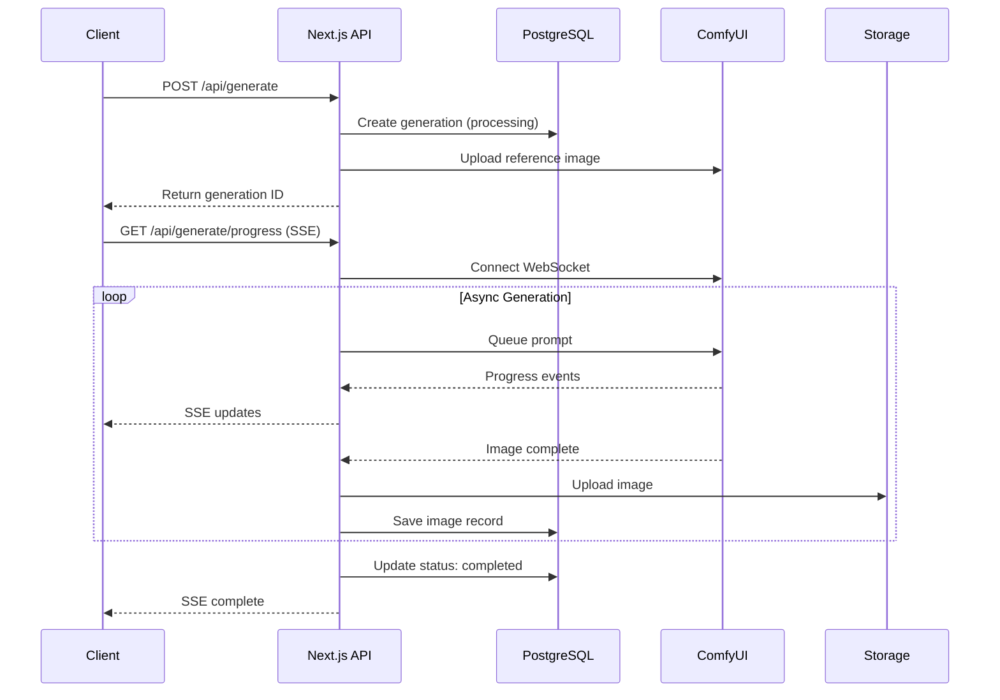

# Codebase Documentation & Architecture Guide

**Status:** Completed  
**Date:** January 2026

This document summarizes the comprehensive documentation effort for the Bulletproof AI Image Generator codebase and provides an architecture overview with findings from the deep code review.

---

## Table of Contents

1. [Documentation Completed](#documentation-completed)
2. [Architecture Overview](#architecture-overview)
3. [Technology Stack](#technology-stack)
4. [Data Flow](#data-flow)
5. [Key Design Decisions](#key-design-decisions)
6. [Code Review Findings](#code-review-findings)
7. [Recommended Improvements](#recommended-improvements)

---

## Documentation Completed

### Core Library Files (JSDoc + Inline Comments)

| File | Description | Status |
|------|-------------|--------|
| `src/lib/schema.ts` | Database schema with 5 tables | ✅ Documented |
| `src/lib/comfyui.ts` | ComfyUIClient class with 4 workflow methods | ✅ Documented |
| `src/lib/data/templates.ts` | All 12 template categories | ✅ Documented |
| `src/lib/types/generation.ts` | 25+ type definitions | ✅ Documented |

### Architecture Documentation

| Document | Location | Contents |
|----------|----------|----------|
| ARCHITECTURE.md | `docs/technical/ARCHITECTURE.md` | System overview, 5 Mermaid diagrams |
| API.md | `docs/technical/API.md` | Complete API reference, 3 sequence diagrams |

### Component Documentation (15 files)

| Component | Purpose |
|-----------|---------|
| `three-column-layout.tsx` | Responsive 3-column/tabbed layout with ASCII diagram |
| `generation-error-alert.tsx` | Error classification and display system |
| `generation-progress.tsx` | Real-time progress badges |
| `preview/preview-panel.tsx` | Generation settings & controls |
| `prompt-builder/prompt-builder-panel.tsx` | Template selection container |
| `prompt-builder/template-selector.tsx` | Dropdown with modal trigger |
| `prompt-builder/subject-manager.tsx` | Subject list management |
| `prompt-builder/subject-card.tsx` | Individual subject editor |
| `prompt-builder/template-selector-modal.tsx` | Full template picker modal |
| `prompt-builder/template-modal.tsx` | Simple template picker |
| `results/results-panel.tsx` | Image grid/comparison display |
| `results/image-card.tsx` | Single image with actions |
| `results/image-skeleton.tsx` | Loading placeholders |
| `results/refine-input.tsx` | Refinement instruction input |
| `results/image-comparison-slider.tsx` | Before/after comparison slider |

### Hooks Documentation (4 files)

| Hook | Purpose | Key Features |
|------|---------|--------------|
| `use-generation.ts` | Generation state management | SSE handling, state machine, progress tracking |
| `use-prompt-builder.ts` | Prompt building logic | FLUX.2 optimal prompt assembly algorithm |
| `use-avatars.ts` | Avatar CRUD operations | FormData upload, optimistic updates |
| `use-presets.ts` | Preset management | Save/load configurations |

### API Routes Documentation (6 files)

| Route | Method | Purpose |
|-------|--------|---------|
| `/api/generate` | POST | Main generation endpoint |
| `/api/generate/progress` | GET (SSE) | Real-time progress tracking |
| `/api/generations` | GET | Paginated generation history |
| `/api/generations/[id]` | GET, DELETE | Single generation operations |
| `/api/avatars` | GET, POST | Avatar list and create |
| `/api/presets` | GET, POST | Preset list and create |

---

## Architecture Overview

### System Diagram

```
┌─────────────────────────────────────────────────────────────────┐
│                        Browser Client                            │
│  ┌──────────────┐  ┌──────────────┐  ┌──────────────┐          │
│  │PromptBuilder │  │ PreviewPanel │  │ ResultsPanel │          │
│  └──────┬───────┘  └──────┬───────┘  └──────┬───────┘          │
│         │                 │                  │                   │
│         └────────────┬────┴──────────────────┘                  │
│                      │                                           │
│              ┌───────▼────────┐                                 │
│              │GenerationProvider                                │
│              │  (React Context)│                                │
│              └───────┬────────┘                                 │
└──────────────────────┼──────────────────────────────────────────┘
                       │
          ┌────────────┼────────────┐
          │ HTTP/SSE   │            │
          ▼            ▼            ▼
┌─────────────────────────────────────────────────────────────────┐
│                     Next.js API Routes                           │
│  ┌──────────────┐  ┌──────────────┐  ┌──────────────┐          │
│  │/api/generate │  │/api/progress │  │/api/avatars  │          │
│  └──────┬───────┘  └──────┬───────┘  └──────┬───────┘          │
└─────────┼─────────────────┼─────────────────┼───────────────────┘
          │                 │                 │
          │    ┌────────────┘                 │
          │    │                              │
          ▼    ▼                              ▼
┌─────────────────────┐              ┌─────────────────────┐
│     ComfyUI         │              │    PostgreSQL       │
│  ┌─────────────┐    │              │  ┌─────────────┐    │
│  │ REST API    │    │              │  │ generations │    │
│  │ WebSocket   │    │              │  │ avatars     │    │
│  │ Workflows   │    │              │  │ presets     │    │
│  └─────────────┘    │              │  └─────────────┘    │
└─────────────────────┘              └─────────────────────┘
          │
          ▼
┌─────────────────────┐
│   Storage Layer     │
│  ┌─────────────┐    │
│  │ Vercel Blob │    │
│  │ Local FS    │    │
│  └─────────────┘    │
└─────────────────────┘
```

### Component Architecture

```
src/
├── app/                          # Next.js App Router
│   ├── page.tsx                  # Main generation page
│   ├── api/                      # API routes
│   │   ├── generate/             # Generation endpoints
│   │   ├── generations/          # History endpoints
│   │   ├── avatars/              # Avatar CRUD
│   │   └── presets/              # Preset CRUD
│   ├── avatars/                  # Avatar management page
│   └── gallery/                  # Public gallery page
│
├── components/
│   ├── generation-provider.tsx   # Global state context
│   ├── generate/                 # Generation UI components
│   │   ├── three-column-layout.tsx
│   │   ├── preview/              # Settings panel
│   │   ├── prompt-builder/       # Template selection
│   │   └── results/              # Image display
│   ├── avatars/                  # Avatar components
│   ├── presets/                  # Preset components
│   └── ui/                       # shadcn/ui primitives
│
├── hooks/
│   ├── use-generation.ts         # Generation state + SSE
│   ├── use-prompt-builder.ts     # Prompt assembly
│   ├── use-avatars.ts            # Avatar operations
│   └── use-presets.ts            # Preset operations
│
└── lib/
    ├── comfyui.ts                # ComfyUI client
    ├── schema.ts                 # Drizzle schema
    ├── storage.ts                # File storage abstraction
    ├── db.ts                     # Database connection
    ├── data/templates.ts         # Prompt templates
    └── types/generation.ts       # TypeScript types
```

---

## Technology Stack

### Frontend

| Technology | Version | Purpose |
|------------|---------|---------|
| Next.js | 16 | React framework with App Router |
| React | 19.2.0 | UI library |
| TypeScript | 5.9.3 | Type safety |
| Tailwind CSS | v4 | Styling |
| shadcn/ui | - | UI components |
| Radix UI | - | Accessible primitives |

### Backend

| Technology | Version | Purpose |
|------------|---------|---------|
| Next.js API Routes | - | REST API endpoints |
| Drizzle ORM | 0.44.7 | Database access |
| PostgreSQL | - | Primary database |
| @vercel/blob | - | Production file storage |

### External Services

| Service | Purpose |
|---------|---------|
| ComfyUI | AI image generation (FLUX.2, upscaling) |
| WebSocket | Real-time progress from ComfyUI |
| SSE | Progress streaming to browser |

---

## Data Flow

### Generation Flow



### State Management Flow

```
User Action → Hook Function → API Call → Database Update
                   ↓
              State Update → Component Re-render
                   ↓
              SSE Connection → Progress Updates
```

---

## Key Design Decisions

### 1. Prompt Assembly Order (FLUX.2 Optimized)

The prompt builder assembles prompts in a specific order optimized for FLUX.2:

```
Style → Camera Model → Subjects → Location → Mood → 
Lighting → Lens → Camera/Composition → Color Palette → Custom
```

**Rationale:** Testing showed FLUX.2 responds best when high-level aesthetic concepts come first, followed by subject details, then technical specifications.

### 2. SSE Bridge Pattern

```
ComfyUI WebSocket → Next.js API → SSE → Browser
```

**Rationale:** Browsers can't connect directly to ComfyUI WebSocket (different origin, authentication). SSE provides a simpler client API than WebSocket for one-way progress updates.

### 3. Workflow-Specific Defaults

Each workflow type has optimized default parameters:

| Workflow | Steps | Guidance | Denoise | Notes |
|----------|-------|----------|---------|-------|
| flux2 | 20 | 4 | - | Standard txt2img |
| z-image-turbo | 9 | 1 | 0.4 | Fast img2img |
| bulletproof-background | 9 | 1 | 0.9 | High denoise for background |
| bulletproof-upscaler | - | - | - | Uses VRAM presets |

### 4. Storage Abstraction

```typescript
// Unified interface for both environments
export async function upload(buffer, filename, folder, options?) { }
export async function readFromStorage(url) { }
```

**Rationale:** Seamless switching between local filesystem (development) and Vercel Blob (production) without code changes.

### 5. Database Schema Design

- **Cascade deletes** on foreign keys for automatic cleanup
- **JSONB fields** for flexible settings storage
- **UUID primary keys** for distributed generation
- **Separate history table** for refinement conversation tracking

---

## Code Review Findings

### Critical Issues

| Issue | Impact | Priority |
|-------|--------|----------|
| Database connection not pooled | Connection exhaustion in serverless | 🔴 High |
| In-memory tracking redundant | Data loss between invocations | 🔴 High |
| Fire-and-forget async generation | May terminate before completion | 🔴 High |
| No timeout on waitForCompletion | Infinite blocking possible | 🟠 Medium |

### Performance Bottlenecks

| Issue | Impact | Priority |
|-------|--------|----------|
| SSE + DB polling redundant | Wasted resources | 🟠 Medium |
| EventSource reconnects on state change | Unnecessary connections | 🟠 Medium |
| No WebSocket reconnection logic | Failed tracking on disconnect | 🟡 Low |

### Maintainability Concerns

| Issue | Impact | Priority |
|-------|--------|----------|
| Magic numbers scattered | Hard to update consistently | 🟠 Medium |
| Duplicated validation logic | Code duplication | 🟠 Medium |
| Oversized hooks (684 lines) | Hard to maintain | 🟠 Medium |
| Prop drilling in PreviewPanel | Unwieldy interface | 🟡 Low |

### Good Patterns Found ✓

- N+1 query prevention with batch loading
- Proper cascade deletes in schema
- useCallback/useMemo used appropriately
- Proper cleanup in useEffect
- Comprehensive JSDoc documentation
- Type-safe discriminated unions

---

## Recommended Improvements

### High Priority (Immediate)

1. **Fix database connection pooling**
   - Use singleton pattern with connection pool
   - See: `docs/codereview/` for implementation details

2. **Remove in-memory tracking**
   - Already stored in database (`comfyuiPromptId` column)
   - Delete `src/lib/generation-tracking.ts`

3. **Add timeout to waitForCompletion**
   - Configurable timeout with clear defaults
   - Throw error on timeout

4. **Fix SSE dependency array**
   - Use refs for values that shouldn't trigger reconnection

### Medium Priority (Next Sprint)

5. **Centralize magic numbers**
   - Create `src/lib/constants/generation.ts`
   - See: `docs/codereview/centralize-magic-numbers.md`

6. **Extract shared validation**
   - Create Zod schemas for request validation
   - Share between API and UI

7. **Split large hooks**
   - `useGenerationProgress` - SSE only
   - `useGenerationList` - Pagination
   - `useGenerationMutations` - CRUD

8. **Add structured logging**
   - Replace console.log with logger
   - Add log levels (debug, info, warn, error)

### Low Priority (Tech Debt)

9. **Implement rate limiting**
   - Protect generation endpoints
   - Use Upstash or similar

10. **Add file MIME validation**
    - Validate actual content, not just extension
    - Use file-type library

11. **Request deduplication**
    - Prevent double-click submissions
    - Add debouncing or request ID

---

## Documentation Standards

### JSDoc Format Used

```typescript
/**
 * @fileoverview Brief description of the file
 * 
 * Detailed explanation of purpose and usage.
 * 
 * @module module-name
 */

/**
 * Function description
 * 
 * @param paramName - Parameter description
 * @returns Return value description
 * @throws Error conditions
 * 
 * @example
 * ```typescript
 * const result = functionName(arg);
 * ```
 */
```

### Inline Comments Used

```typescript
// ============================================================================
// SECTION HEADER
// ============================================================================

// Single-line explanation for complex logic

/**
 * Multi-line explanation for algorithms
 * with step-by-step breakdown
 */
```

### Component Documentation Pattern

```typescript
/**
 * ComponentName - Brief description
 * 
 * ## Purpose
 * What this component does
 * 
 * ## Layout (ASCII diagram)
 * Visual representation
 * 
 * ## Props
 * - propName: Description
 * 
 * ## Usage
 * ```tsx
 * <ComponentName prop={value} />
 * ```
 */
```

---

## Related Documents

| Document | Location | Purpose |
|----------|----------|---------|
| ARCHITECTURE.md | `docs/technical/ARCHITECTURE.md` | System diagrams |
| API.md | `docs/technical/API.md` | API reference |
| Centralize Magic Numbers | `docs/codereview/centralize-magic-numbers.md` | Implementation plan |
| CLAUDE.md | `./CLAUDE.md` | AI assistant context |

---

## Appendix: Template Categories

The prompt builder includes 12 template categories:

| Category | Count | Purpose |
|----------|-------|---------|
| Style | 12 | Overall aesthetic (cinematic, documentary, etc.) |
| Camera Model | 10 | Photorealistic authenticity |
| Lens | 10 | Optical characteristics |
| Mood | 12 | Emotional atmosphere |
| Color Palette | 10 | Color grading presets |
| Lighting | 10 | Illumination styles |
| Location | 15 | Environment settings |
| Camera/Composition | 10 | Shot types and angles |
| Pose | 10 | Subject positioning |
| Action | 10 | Subject activities |
| Clothing | 12 | Wardrobe options |
| Expression | 10 | Facial expressions |

Each template provides:
- `id`: Unique identifier
- `name`: Display name
- `promptFragment`: Actual text injected into prompt
- `category`: Grouping for UI
