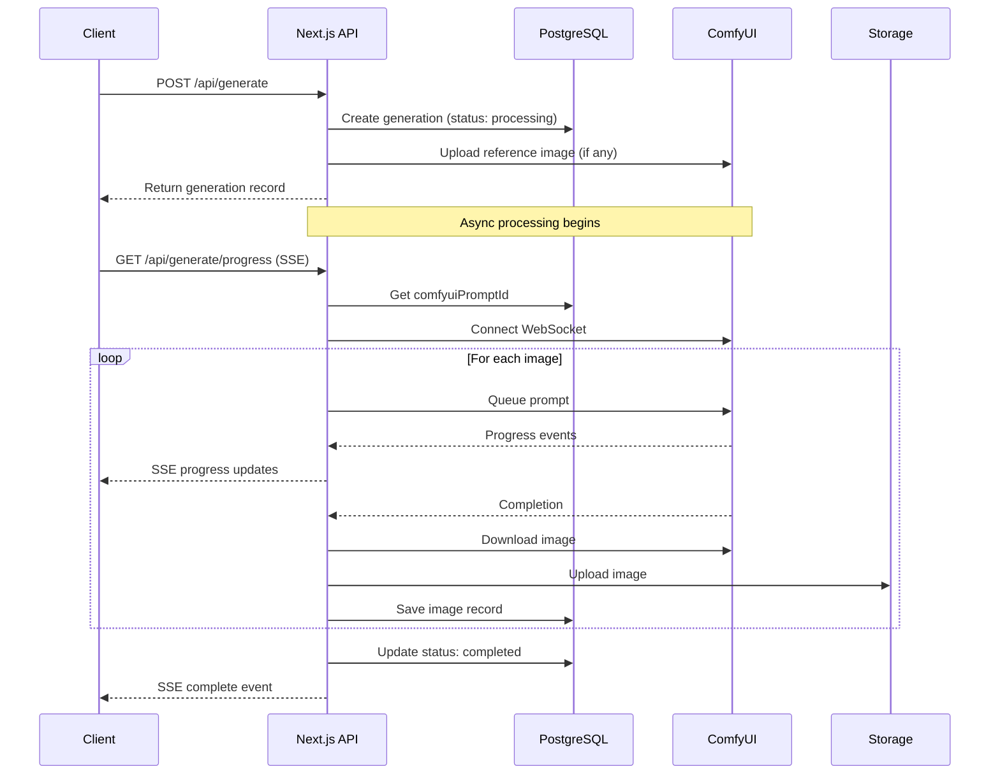
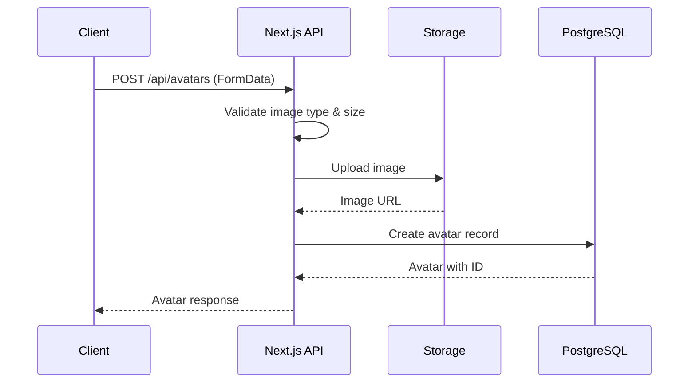
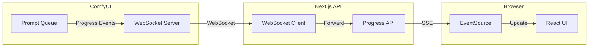

# API Reference

This document provides a comprehensive reference for all API endpoints in the Bulletproof Image Generator.

## Table of Contents

- [Overview](#overview)
- [Authentication](#authentication)
- [Endpoints](#endpoints)
  - [Generate](#generate)
  - [Generations](#generations)
  - [Avatars](#avatars)
  - [Presets](#presets)
  - [Gallery](#gallery)
- [Error Handling](#error-handling)
- [Sequence Diagrams](#sequence-diagrams)

---

## Overview

The API follows RESTful conventions and uses JSON for request/response bodies (except for multipart uploads). All endpoints are prefixed with `/api/`.

### Base URL

```
http://localhost:3000/api
```

### Common Response Format

```json
{
  "data": { ... },        // Success response
  "error": "message"      // Error response
}
```

---

## Authentication

Currently, the application runs without authentication (auth was removed for simplicity). All endpoints are publicly accessible.

---

## Endpoints

### Generate

#### POST /api/generate

Start a new image generation using ComfyUI.

**Request Body:**

```json
{
  "prompt": "A beautiful sunset over mountains",
  "settings": {
    "resolution": "2K",
    "aspectRatio": "16:9",
    "imageCount": 2,
    "steps": 20,
    "guidance": 4,
    "seed": null,
    "workflow": "flux2"
  },
  "referenceImages": [
    {
      "avatarId": "abc123",
      "type": "human"
    }
  ]
}
```

**Settings Parameters:**

| Parameter | Type | Required | Default | Description |
|-----------|------|----------|---------|-------------|
| resolution | string | ✓ | - | "1K", "2K", or "4K" |
| aspectRatio | string | ✓ | - | "1:1", "16:9", "9:16", "4:3", "3:4", "21:9" |
| imageCount | number | - | 1 | 1-4 images per generation |
| steps | number | - | 20 | Diffusion steps (1-50) |
| guidance | number | - | 4 | CFG scale (1-10) |
| seed | number | - | random | Seed for reproducibility |
| workflow | string | - | "flux2" | See workflow types below |

**Workflow Types:**

| Workflow | Description | Required Settings |
|----------|-------------|-------------------|
| flux2 | Standard text-to-image | - |
| z-image-turbo | Fast img2img | denoise, largestSize, shift, referenceImage |
| bulletproof-background | Background replacement | denoise, detectionConfidence, subjectToDetect, referenceImage |
| bulletproof-upscaler | AI upscaling | vramPreset, referenceImage |

**Response (201):**

```json
{
  "generation": {
    "id": "gen_xyz",
    "prompt": "A beautiful sunset...",
    "settings": { ... },
    "status": "processing",
    "comfyuiPromptId": "abc-123",
    "images": [],
    "createdAt": "2024-01-01T00:00:00Z"
  }
}
```

**Errors:**

| Status | Description |
|--------|-------------|
| 400 | Invalid request (missing/invalid fields) |
| 503 | ComfyUI server unavailable |
| 500 | Internal server error |

---

#### GET /api/generate/progress

Server-Sent Events endpoint for real-time generation progress.

**Query Parameters:**

| Parameter | Type | Required | Description |
|-----------|------|----------|-------------|
| promptId | string | ✓ | Generation database ID |
| imageIndex | number | - | Current image (1-based) |
| totalImages | number | - | Total images in generation |

**SSE Event Types:**

```javascript
// Connected event
{ "type": "connected", "status": "Connecting to ComfyUI..." }

// Progress event
{
  "type": "progress",
  "currentStep": 10,
  "totalSteps": 20,
  "percentage": 50,
  "status": "Step 10 of 20"
}

// Complete event
{ "type": "complete", "percentage": 100, "status": "Complete" }

// Error event
{ "type": "error", "message": "Generation failed" }
```

**Usage:**

```javascript
const eventSource = new EventSource(
  `/api/generate/progress?promptId=${id}&imageIndex=1&totalImages=2`
);

eventSource.onmessage = (event) => {
  const data = JSON.parse(event.data);
  console.log(data.type, data.percentage);
};
```

---

#### POST /api/generate/{id}/refine

Refine an existing generation with natural language instructions.

**Request Body:**

```json
{
  "instruction": "Make the sky more orange",
  "selectedImageId": "img_123"
}
```

**Response (200):**

```json
{
  "generation": { ... },
  "history": [
    { "role": "user", "content": "..." },
    { "role": "assistant", "content": "..." }
  ]
}
```

---

### Generations

#### GET /api/generations

List all generations with pagination.

**Query Parameters:**

| Parameter | Type | Default | Description |
|-----------|------|---------|-------------|
| page | number | 1 | Page number (1-indexed) |
| pageSize | number | 10 | Items per page (max 50) |

**Response:**

```json
{
  "items": [
    {
      "id": "gen_123",
      "prompt": "...",
      "settings": { ... },
      "status": "completed",
      "images": [
        { "id": "img_1", "imageUrl": "..." }
      ],
      "createdAt": "2024-01-01T00:00:00Z"
    }
  ],
  "total": 100,
  "page": 1,
  "pageSize": 10,
  "hasMore": true
}
```

---

#### GET /api/generations/{id}

Get a specific generation with its history.

**Response:**

```json
{
  "generation": { ... },
  "history": [
    { "role": "user", "content": "...", "imageUrls": [...] },
    { "role": "assistant", "content": "...", "imageUrls": [...] }
  ]
}
```

---

#### DELETE /api/generations/{id}

Delete a generation and all its associated images.

**Response (200):**

```json
{
  "success": true
}
```

---

### Avatars

#### GET /api/avatars

List all avatars.

**Response:**

```json
{
  "avatars": [
    {
      "id": "avatar_123",
      "name": "John Doe",
      "description": "CEO portrait",
      "avatarType": "human",
      "imageUrl": "/uploads/avatars/...",
      "createdAt": "2024-01-01T00:00:00Z"
    }
  ]
}
```

---

#### POST /api/avatars

Create a new avatar with image upload.

**Request (multipart/form-data):**

| Field | Type | Required | Description |
|-------|------|----------|-------------|
| name | string | ✓ | Avatar name |
| avatarType | string | ✓ | "human" or "object" |
| description | string | - | Optional description |
| image | File | ✓ | Image file (max 5MB) |

**Allowed Image Types:** JPEG, PNG, GIF, WEBP

**Response (201):**

```json
{
  "avatar": { ... }
}
```

---

#### PUT /api/avatars/{id}

Update an avatar's metadata (not image).

**Request Body:**

```json
{
  "name": "Updated Name",
  "description": "Updated description"
}
```

---

#### DELETE /api/avatars/{id}

Delete an avatar and its image.

---

### Presets

#### GET /api/presets

List all presets.

**Response:**

```json
{
  "presets": [
    {
      "id": "preset_123",
      "name": "Corporate Portrait",
      "config": {
        "promptBuilderState": { ... },
        "settings": { ... }
      },
      "createdAt": "2024-01-01T00:00:00Z"
    }
  ]
}
```

---

#### POST /api/presets

Create a new preset.

**Request Body:**

```json
{
  "name": "My Preset",
  "config": {
    "promptBuilderState": {
      "style": "template-cinematic",
      "location": "template-modern-office",
      "subjects": []
    },
    "settings": {
      "resolution": "2K",
      "aspectRatio": "1:1"
    }
  }
}
```

---

#### PUT /api/presets/{id}

Update a preset.

---

#### DELETE /api/presets/{id}

Delete a preset.

---

### Gallery

#### GET /api/gallery/public

Get public gallery images.

**Response:**

```json
{
  "images": [
    {
      "id": "img_123",
      "imageUrl": "...",
      "generationId": "gen_123",
      "createdAt": "2024-01-01T00:00:00Z"
    }
  ]
}
```

---

## Error Handling

All errors follow this format:

```json
{
  "error": "Human-readable error message"
}
```

### Common HTTP Status Codes

| Status | Description |
|--------|-------------|
| 200 | Success |
| 201 | Created |
| 400 | Bad Request (validation error) |
| 404 | Not Found |
| 500 | Internal Server Error |
| 503 | Service Unavailable (ComfyUI down) |

---

## Sequence Diagrams

### Image Generation Flow



### Avatar Upload Flow



### Progress Tracking Architecture



---

## Rate Limiting

Currently, no rate limiting is implemented. For production deployment, consider adding:

- Request rate limiting per IP
- Concurrent generation limits
- File upload size limits (currently 5MB for avatars, 50MB for generations)

---

## WebSocket Events

The application bridges ComfyUI WebSocket events to HTTP clients via SSE. Direct WebSocket connections are handled internally by the `ComfyUIClient` class.

### ComfyUI WebSocket Message Types

| Type | Description |
|------|-------------|
| `progress` | Diffusion step progress |
| `executing` | Node execution status |
| `executed` | Node completed |
| `execution_cached` | Using cached results |
| `execution_error` | Error occurred |

---

## Environment Variables

| Variable | Description | Default |
|----------|-------------|---------|
| COMFYUI_URL | ComfyUI server URL | http://localhost:8000 |
| DATABASE_URL | PostgreSQL connection string | - |
| BLOB_READ_WRITE_TOKEN | Vercel Blob token (production) | - |
| NODE_ENV | Environment | development |

---

## TypeScript Types

All request/response types are defined in `src/lib/types/generation.ts`. Key types:

- `GenerateImageRequest` - Generation request body
- `GenerationWithImages` - Generation with associated images
- `Avatar` - Avatar entity
- `Preset` - Preset entity
- `PaginatedResponse<T>` - Generic paginated response
