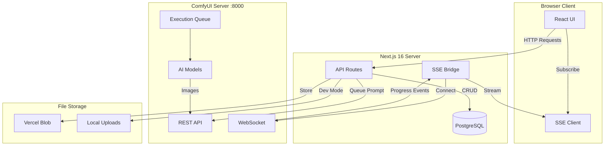
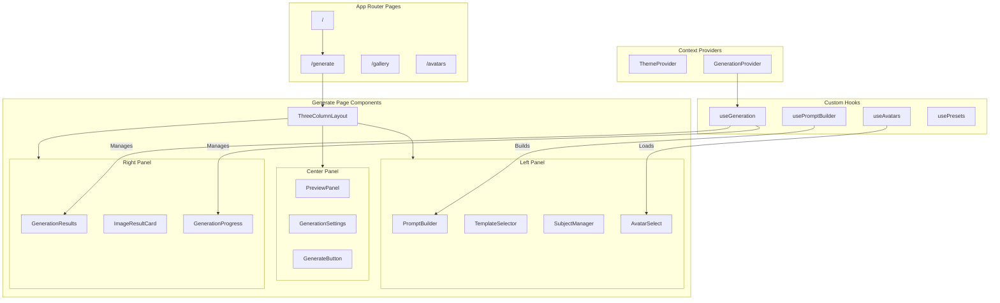
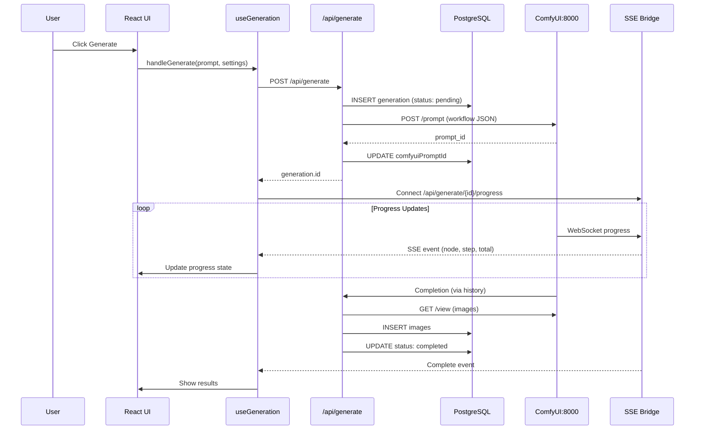
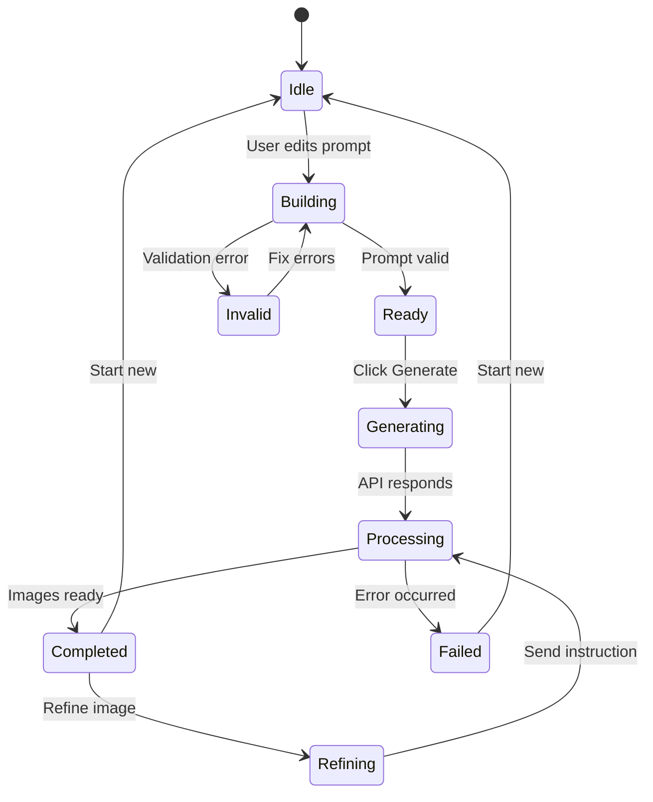
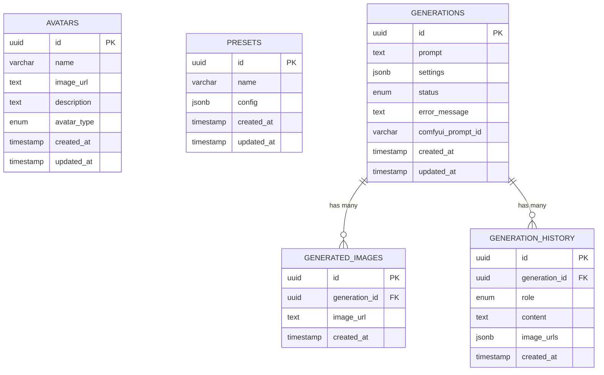
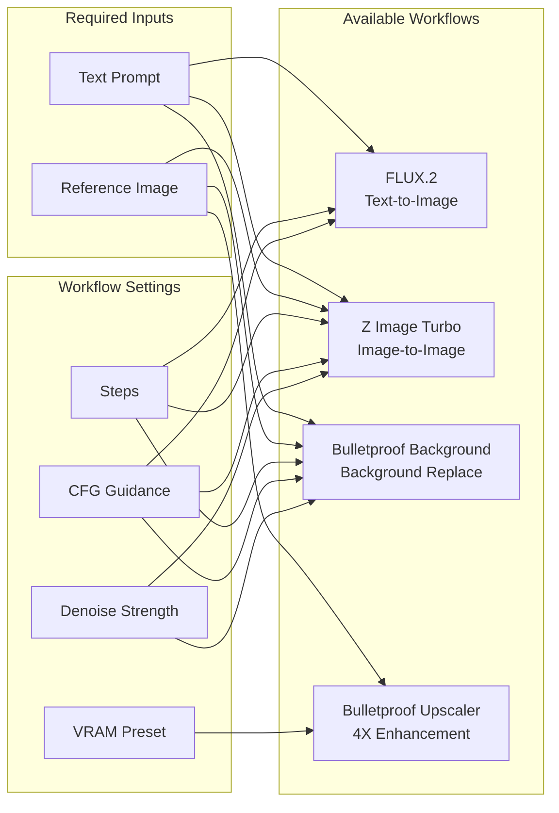
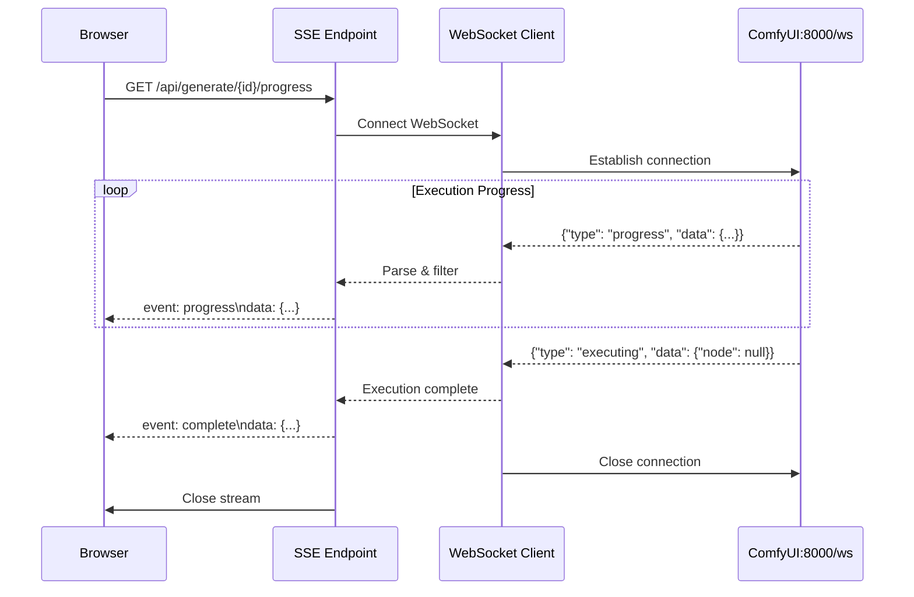
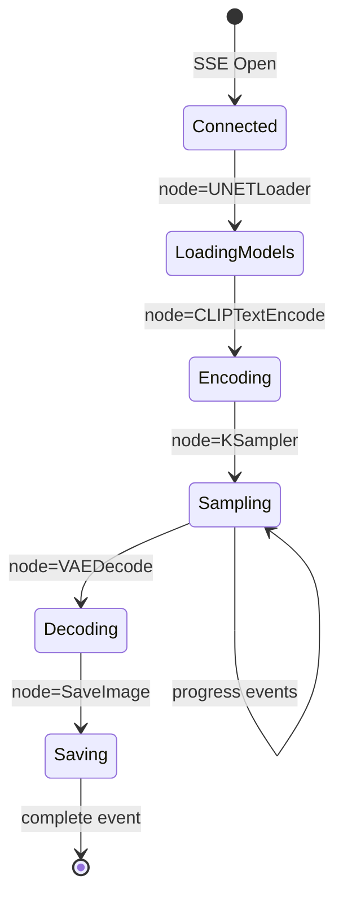
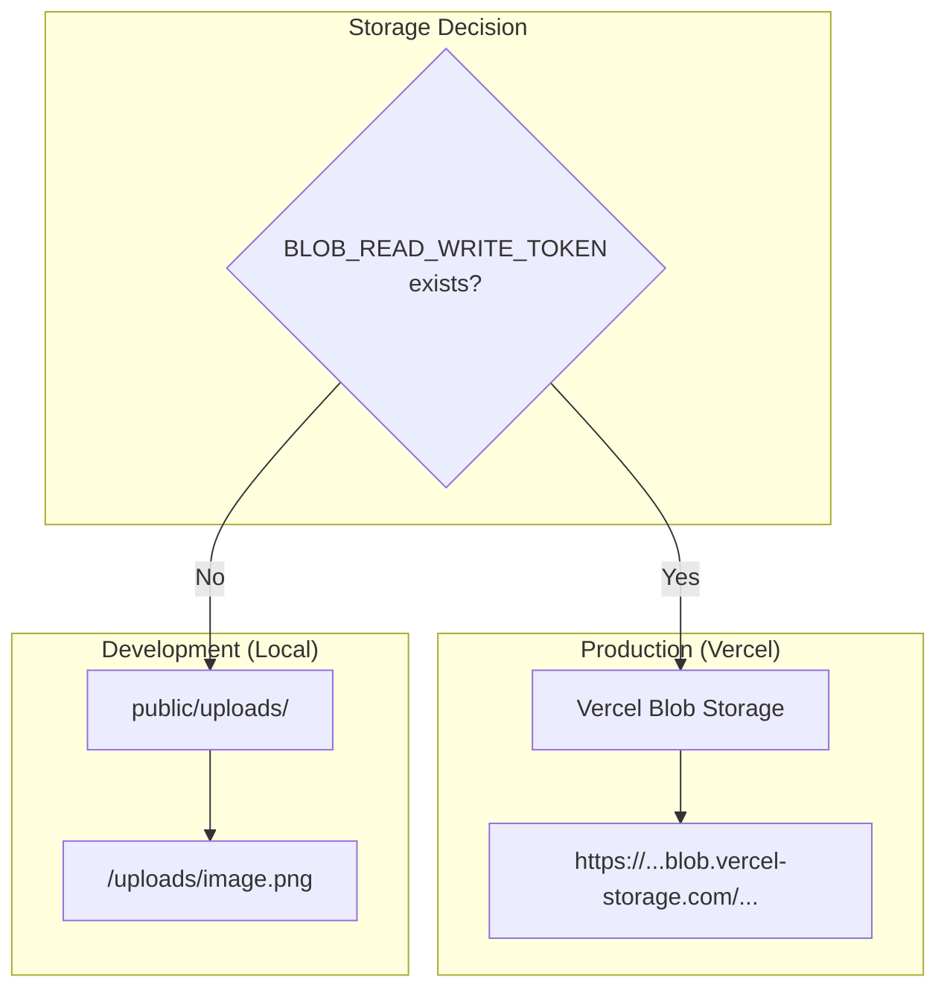

# Bulletproof AI Image Generator - Architecture Documentation

> **Version:** 1.0  
> **Last Updated:** January 2025  
> **Tech Stack:** Next.js 16 • React 19 • TypeScript 5.9 • Drizzle ORM • PostgreSQL • ComfyUI

## Table of Contents

1. [System Overview](#system-overview)
2. [Technology Stack](#technology-stack)
3. [Component Architecture](#component-architecture)
4. [Data Flow](#data-flow)
5. [Database Schema](#database-schema)
6. [Generation Workflows](#generation-workflows)
7. [Real-time Progress Tracking](#real-time-progress-tracking)
8. [Storage Strategy](#storage-strategy)
9. [Key Design Decisions](#key-design-decisions)

---

## System Overview

Bulletproof AI is a professional-grade image generation platform that provides a user-friendly interface for ComfyUI workflows. The system enables text-to-image and image-to-image generation with real-time progress tracking.



### Key Architectural Principles

1. **Server-Side Generation**: All ComfyUI communication happens server-side to hide API complexity
2. **Real-time Feedback**: WebSocket→SSE bridge provides live progress without client-side WS
3. **Environment Adaptive**: Automatically switches between Vercel Blob (production) and local storage (development)
4. **Workflow Abstraction**: Users interact with settings, not ComfyUI node graphs

---

## Technology Stack

### Frontend

| Technology | Version | Purpose |
|-----------|---------|---------|
| React | 19.2.0 | UI library with concurrent features |
| Next.js | 16.0.0 | Full-stack framework with App Router |
| TypeScript | 5.9.3 | Type safety and DX |
| Tailwind CSS | 4.0 | Utility-first styling |
| shadcn/ui | Latest | Accessible component primitives |
| Radix UI | Various | Headless UI primitives |
| next-themes | 0.4.x | Dark/light mode |
| Lucide React | Latest | Icon system |

### Backend

| Technology | Version | Purpose |
|-----------|---------|---------|
| Next.js API Routes | 16.0.0 | REST API endpoints |
| Drizzle ORM | 0.44.7 | Type-safe database access |
| PostgreSQL | 16+ | Primary database |
| @vercel/blob | Latest | Production file storage |
| Server-Sent Events | Native | Real-time progress streaming |

### AI/ML (External)

| Technology | Purpose |
|-----------|---------|
| ComfyUI | Workflow execution engine |
| FLUX.1 Dev | Primary text-to-image model |
| FLUX.2 Schnell | High-quality text-to-image |
| Z Image Turbo | Fast image-to-image |
| SAM3 | Subject segmentation |
| Ultimate SD Upscale | 4X image upscaling |

---

## Component Architecture



### Component Responsibilities

| Component | Responsibility |
|-----------|----------------|
| `ThreeColumnLayout` | Responsive grid layout with collapsible panels |
| `PromptBuilder` | Template selection and subject configuration |
| `TemplateSelector` | Category tabs with template cards |
| `SubjectManager` | Add/remove/configure subjects |
| `AvatarSelect` | Avatar picker with search |
| `PreviewPanel` | Assembled prompt preview with editing |
| `GenerationSettings` | Resolution, aspect ratio, workflow selection |
| `GenerateButton` | Validation and generation trigger |
| `GenerationResults` | Scrollable results with pagination |
| `ImageResultCard` | Individual image with actions |
| `GenerationProgress` | Real-time progress badges |

---

## Data Flow

### Generation Request Flow



### State Management Flow



---

## Database Schema



### Table Relationships

- **Generations → GeneratedImages**: One-to-many, CASCADE DELETE
- **Generations → GenerationHistory**: One-to-many, CASCADE DELETE
- **Avatars**: Standalone, referenced by ID in preset configs
- **Presets**: Standalone, stores JSON configuration

### Indexes

| Index | Table | Columns | Purpose |
|-------|-------|---------|---------|
| `idx_generations_created_at` | generations | created_at DESC | Gallery pagination |
| `idx_generated_images_generation_id` | generated_images | generation_id | Foreign key lookup |
| `idx_generation_history_generation_id` | generation_history | generation_id | Foreign key lookup |

---

## Generation Workflows

The system supports four distinct image generation workflows, each built from ComfyUI nodes:



### Workflow Comparison

| Feature | FLUX.2 | Z Image Turbo | Background | Upscaler |
|---------|--------|---------------|------------|----------|
| Input | Text only | Text + Image | Text + Image | Image only |
| Output | New image | Transformed | New background | 4X larger |
| Steps | 20 (1-50) | 9 (1-20) | 9 (1-20) | N/A |
| Guidance | 4 (1-10) | 1 (1-5) | 1 (1-5) | N/A |
| Speed | Medium | Fast | Medium | Slow |
| VRAM | ~8GB | ~6GB | ~8GB | Variable |

### FLUX.2 Workflow (Text-to-Image)

```
┌─────────────────┐     ┌──────────────────┐     ┌─────────────────┐
│  UNETLoader     │────▶│  KSampler        │────▶│  VAEDecode      │
│  (flux1-dev)    │     │  (denoise=1.0)   │     │  (ae.safetensors│
└─────────────────┘     └──────────────────┘     └────────┬────────┘
                                ▲                         │
                                │                         ▼
┌─────────────────┐     ┌──────────────────┐     ┌─────────────────┐
│  CLIPLoader     │────▶│  CLIPTextEncode  │     │  SaveImage      │
│  (t5xxl,clip_l) │     │  (user prompt)   │     │  (output/)      │
└─────────────────┘     └──────────────────┘     └─────────────────┘
```

### Z Image Turbo Workflow (Image-to-Image)

```
┌─────────────────┐     ┌──────────────────┐
│  LoadImage      │────▶│  ImageResize     │
│  (reference)    │     │  (largest_size)  │
└─────────────────┘     └────────┬─────────┘
                                 │
                                 ▼
┌─────────────────┐     ┌──────────────────┐     ┌─────────────────┐
│  UNETLoader     │────▶│  KSampler        │────▶│  VAEDecode      │
│  (flux1-dev)    │     │  (denoise=0.4)   │     │                 │
└─────────────────┘     └──────────────────┘     └────────┬────────┘
                                ▲                         │
                                │                         ▼
┌─────────────────┐     ┌──────────────────┐     ┌─────────────────┐
│  FluxGuidance   │────▶│  SamplerCustom   │     │  SaveImage      │
│  (guidance=1)   │     │  Advanced        │     │                 │
└─────────────────┘     └──────────────────┘     └─────────────────┘
```

---

## Real-time Progress Tracking

The system uses a WebSocket→SSE bridge pattern to provide real-time progress without exposing WebSockets to the client.



### Progress Event Types

| Event Type | Data | Meaning |
|------------|------|---------|
| `connected` | `{promptId}` | SSE stream established |
| `progress` | `{node, step, total}` | Step completed in node |
| `executing` | `{node}` | Node execution started |
| `complete` | `{promptId}` | Generation finished |
| `error` | `{message}` | Error occurred |

### Progress UI States



---

## Storage Strategy



### File Organization

```
public/uploads/
├── avatars/           # Uploaded avatar images
│   └── {uuid}.{ext}
├── references/        # Temp reference images
│   └── {uuid}.{ext}
└── (other temp files)

ComfyUI/output/        # Generated images (fetched via API)
├── ComfyUI_{id}_.png
└── ...
```

### Storage Selection Logic

```typescript
// From lib/storage.ts
async function uploadFile(file: File): Promise<string> {
  if (process.env.BLOB_READ_WRITE_TOKEN) {
    // Production: Use Vercel Blob
    const blob = await put(file.name, file, { access: 'public' });
    return blob.url;
  } else {
    // Development: Save to public/uploads
    const path = `/uploads/${uuid()}.${ext}`;
    await writeFile(`public${path}`, buffer);
    return path;
  }
}
```

---

## Key Design Decisions

### 1. Server-Side ComfyUI Communication

**Decision**: All ComfyUI interaction happens through Next.js API routes.

**Rationale**:
- Hides complex workflow JSON from frontend
- Enables server-side image processing
- Centralizes error handling
- Supports environment-specific configuration

### 2. WebSocket→SSE Bridge

**Decision**: Use Server-Sent Events instead of direct WebSocket.

**Rationale**:
- Simpler client-side code (native EventSource)
- Better Vercel/serverless compatibility
- Automatic reconnection built-in
- Unidirectional data flow matches use case

### 3. Drizzle ORM over Prisma

**Decision**: Use Drizzle ORM for database access.

**Rationale**:
- Smaller bundle size
- TypeScript-first design
- Better SQL control with query builder
- Faster cold starts for serverless

### 4. Template-Based Prompt Building

**Decision**: Pre-built templates over freeform input.

**Rationale**:
- Ensures consistent, high-quality prompts
- Reduces learning curve for users
- Enables prompt engineering best practices
- Allows categorized, searchable templates

### 5. Multi-Workflow Architecture

**Decision**: Support multiple ComfyUI workflows.

**Rationale**:
- Different use cases need different workflows
- Upscaling requires different node graph
- Background replacement needs SAM3
- Future extensibility for new workflows

### 6. JSON Settings Storage

**Decision**: Store generation settings as JSONB.

**Rationale**:
- Schema flexibility as workflows evolve
- Easy to add new settings without migrations
- Natural fit for workflow-specific options
- Efficient querying with PostgreSQL JSONB

---

## Appendix: Environment Variables

| Variable | Required | Purpose |
|----------|----------|---------|
| `DATABASE_URL` | Yes | PostgreSQL connection string |
| `COMFYUI_URL` | No | ComfyUI server URL (default: http://localhost:8000) |
| `BLOB_READ_WRITE_TOKEN` | Prod | Vercel Blob storage token |
| `NEXT_PUBLIC_APP_URL` | No | Public app URL for callbacks |

---

## Appendix: File Structure

```
src/
├── app/                    # Next.js App Router
│   ├── api/               # API routes
│   │   ├── avatars/       # Avatar CRUD
│   │   ├── generate/      # Generation endpoints
│   │   ├── presets/       # Preset CRUD
│   │   └── upload/        # File upload
│   ├── avatars/           # Avatar management page
│   ├── gallery/           # Generation history
│   ├── generate/          # Main generation page
│   └── layout.tsx         # Root layout with providers
│
├── components/
│   ├── generate/          # Generation-specific components
│   │   ├── preview/       # Preview panel components
│   │   ├── prompt-builder/# Prompt building components
│   │   └── results/       # Results display components
│   ├── ui/                # shadcn/ui primitives
│   └── (shared)           # Shared components
│
├── hooks/                 # Custom React hooks
│   ├── use-generation.ts  # Generation state & SSE
│   ├── use-prompt-builder.ts # Prompt assembly
│   ├── use-avatars.ts     # Avatar data fetching
│   └── use-presets.ts     # Preset management
│
└── lib/
    ├── comfyui.ts         # ComfyUI client
    ├── schema.ts          # Database schema
    ├── storage.ts         # File storage utilities
    ├── data/
    │   └── templates.ts   # Prompt templates
    └── types/
        └── generation.ts  # TypeScript types
```

---

*This documentation is maintained alongside the codebase. For implementation details, see inline JSDoc comments in source files.*
